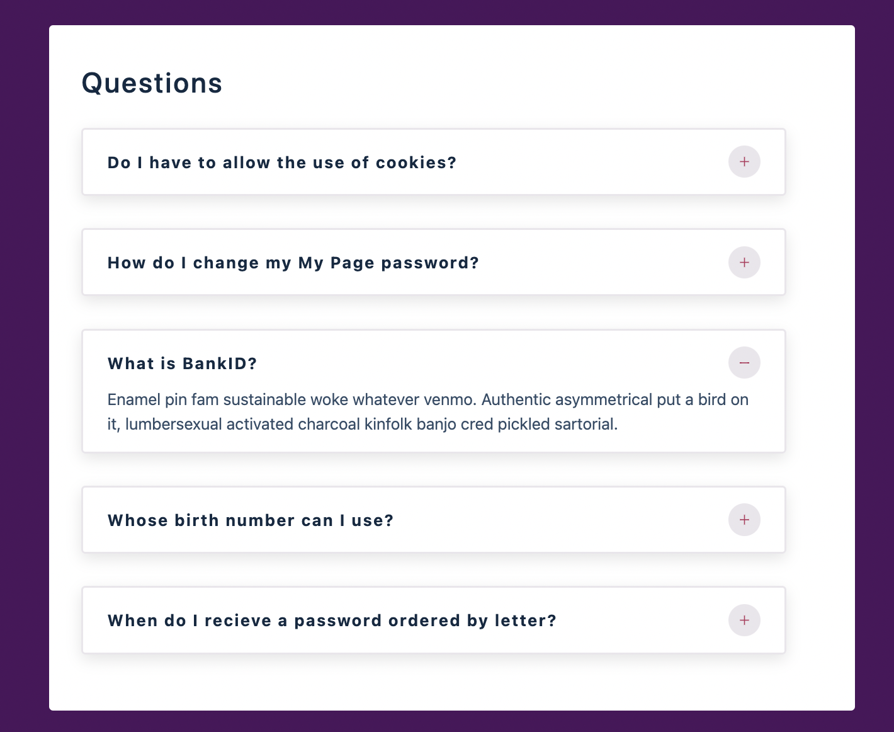

## Idea

[uidesigndaily](https://uidesigndaily.com/posts/sketch-accordion-website-day-1175)


## React Icons

[react icons](https://react-icons.github.io/react-icons/)

```
npm install react-icons --save
```

## Description
- A web of questions
- The answers of questions could be shown and hidden by clicking the plus and minus button

## A capture of the web

